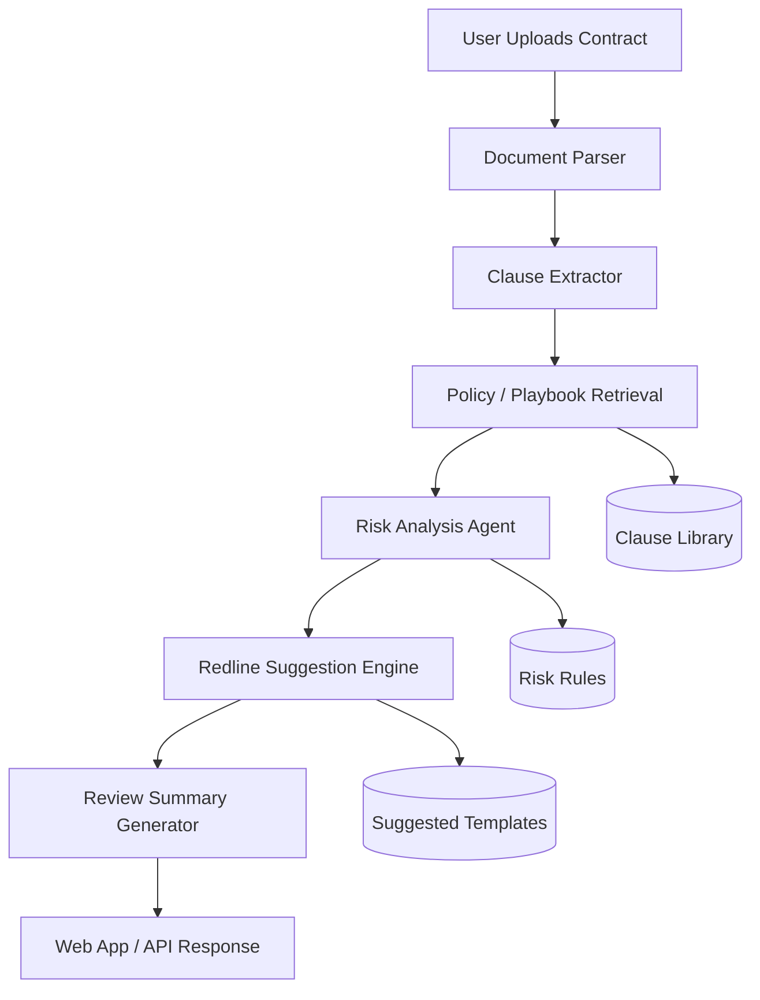

**LexIA** is an AI agent for technology and intellectual property contract review. It helps legal, product, procurement, and startup teams detect risky clauses, compare agreements against policy, suggest redlines, and produce clear review summaries faster.

[](#)
[](#)
[](#)
[](#)

---

## Table of Contents

- [Overview](#overview)
- [Problem Statement](#problem-statement)
- [Key Features](#key-features)
- [How It Works](#how-it-works)
- [Architecture](#architecture)
- [Use Cases](#use-cases)
- [Repository Structure](#repository-structure)
- [Getting Started](#getting-started)
- [Configuration](#configuration)
- [Usage](#usage)
- [API Design](#api-design)
- [Security and Legal Notes](#security-and-legal-notes)
- [Roadmap](#roadmap)
- [Contributing](#contributing)
- [License](#license)
- [Acknowledgements](#acknowledgements)

---

## Overview

LexIA is designed to streamline contract review by combining clause extraction, policy comparison, risk detection, and suggested edits into a single AI-assisted workflow. This follows the same general pattern used in modern automated contract review scenarios: ingest the contract, compare it against templates or policy, identify deviations, suggest alternative clauses, and produce a concise summary for review [web:8].

The goal is not to replace legal judgment. The goal is to reduce manual repetition so humans can focus on negotiation, exceptions, and decision-making.

---

## Problem Statement

Technology and IP contracts often contain clauses that are hard to track manually, especially across NDAs, MSAs, SOWs, licensing agreements, SaaS terms, assignment clauses, confidentiality terms, indemnities, and data protection addenda. Teams often lose time comparing drafts against internal standards and identifying non-standard language.

LexIA addresses this by:
- Highlighting deviations from approved policy.
- Flagging legal and commercial risk patterns.
- Suggesting clearer alternative language.
- Generating a structured review memo for faster decision-making.

---

## Key Features

- Clause extraction from uploaded contracts.
- Policy-based contract comparison.
- Risk detection for non-standard or ambiguous language.
- Suggested redlines and alternative clauses.
- Summary output for legal and business review.
- Support for technology, software, and IP-focused agreements.
- Audit-friendly output with traceable findings.
- Modular architecture for future integrations.

---

## How It Works

LexIA follows a five-step review flow aligned with modern AI legal agent patterns: contract ingestion, template comparison, risk identification, clause suggestions, and review summary [web:8].

1. The user uploads a contract in PDF, DOCX, or text form.
2. The agent extracts relevant clauses and metadata.
3. LexIA compares the document against a policy library or clause playbook.
4. The agent flags risky or missing terms.
5. The system returns a review report with suggestions and a plain-language summary.

Example:
- Input: SaaS agreement with custom indemnity language.
- Output: Clause flagged as high-risk, suggested fallback wording, and a short explanation for legal review.

---

## Architecture



### Core Components

- **Document Parser**: Reads PDF, DOCX, and plain text.
- **Clause Extractor**: Identifies sections such as confidentiality, IP ownership, liability, and termination.
- **Policy Engine**: Compares clauses against approved internal standards.
- **Risk Agent**: Assigns severity and explains why a clause is a concern.
- **Suggestion Engine**: Proposes fallback language.
- **Summary Generator**: Produces a short, structured report for humans.

---

## Use Cases

LexIA is useful for:
- Startup legal review.
- Vendor contract screening.
- IP assignment verification.
- SaaS procurement review.
- NDAs and MSAs.
- Software licensing analysis.
- First-pass review before counsel escalation.

---

## Repository Structure

```txt
lexia/
├─ app/
│  ├─ main.py
│  ├─ api/
│  ├─ agents/
│  ├─ parsers/
│  ├─ prompts/
│  └─ services/
├─ tests/
├─ docs/
├─ examples/
├─ .env.example
├─ README.md
├─ LICENSE
└─ pyproject.toml
```

---

## Getting Started

### Prerequisites
- Python 3.11 or higher.
- Git.
- A working LLM provider key.
- Optional: OCR tooling for scanned PDFs.

### Installation

```bash
git clone https://github.com/your-username/lexia.git
cd lexia
python -m venv .venv
source .venv/bin/activate
pip install -r requirements.txt
```

### Environment Setup

Create a `.env` file:

```bash
cp .env.example .env
```

Example variables:

```env
LLM_API_KEY=your_api_key_here
MODEL_NAME=gpt-4.1-mini
MAX_TOKENS=4000
TEMPERATURE=0.2
POLICY_LIBRARY_PATH=./docs/policies
```

---

## Configuration

LexIA can be configured to adapt to different organizations and review standards.

Recommended configuration options:
- `MODEL_NAME`: model used for clause analysis and generation.
- `TEMPERATURE`: lower values for more deterministic review output.
- `POLICY_LIBRARY_PATH`: location of clause playbooks and fallback templates.
- `RISK_THRESHOLD`: minimum severity to raise a visible warning.
- `OUTPUT_FORMAT`: JSON, Markdown, or HTML.

You can also define contract families such as:
- NDA
- MSA
- SOW
- SaaS Agreement
- IP Assignment Agreement
- Software License Agreement

---

## Usage

### CLI Example

```bash
python -m app.main --file examples/sample_msa.pdf
```

### API Example

```http
POST /review
Content-Type: multipart/form-data
```

Response example:

```json
{
  "document_type": "MSA",
  "risk_level": "high",
  "findings": [
    {
      "clause": "Indemnity",
      "severity": "high",
      "issue": "Broad indemnity obligation without mutuality.",
      "suggestion": "Limit indemnity to direct third-party claims caused by breach or negligence."
    }
  ],
  "summary": "The contract contains several non-standard clauses that should be reviewed before signature."
}
```

### Output Example

- **Issue:** IP ownership is unclear in the contractor clause.
- **Risk:** High.
- **Suggestion:** State that all deliverables and related work product are assigned to the company upon payment.

---

## API Design

### `POST /review`
Uploads a contract and returns a structured analysis report.

### `POST /chat`
Allows guided follow-up questions about the contract findings.

### `GET /health`
Returns service status.

### Recommended Response Schema

```json
{
  "document_id": "string",
  "document_type": "string",
  "summary": "string",
  "risk_score": 0,
  "findings": [
    {
      "id": "string",
      "category": "string",
      "severity": "low|medium|high|critical",
      "clause_text": "string",
      "issue": "string",
      "recommendation": "string"
    }
  ]
}
```

---

## Security and Legal Notes

LexIA is a review assistant, not legal counsel. Its output should be treated as decision support, not a final legal opinion.

Recommended safeguards:
- Do not upload confidential contracts without access controls.
- Store documents securely.
- Log analysis events for auditability.
- Keep human review in the approval loop.
- Separate policy content from generated output.

For production use, add:
- Authentication.
- Role-based access control.
- Encryption at rest and in transit.
- Data retention policies.
- Prompt-injection and document parsing protections.

---

## Roadmap

- OCR support for scanned documents.
- Clause-by-clause diff view.
- Jurisdiction-aware rule packs.
- Multi-language support.
- Playbook editor UI.
- Workflow approvals.
- Export to PDF and DOCX.
- Integration with GitHub Issues, Slack, and Notion.
- Fine-tuned domain classifier for technology/IP agreements.

---

## Contributing

Contributions are welcome.

Suggested workflow:
1. Fork the repository.
2. Create a feature branch.
3. Add tests for new behavior.
4. Submit a pull request with a clear description.
5. Include examples when changing prompts or review logic.

Suggested contribution areas:
- Prompt engineering.
- Clause taxonomy.
- Contract parsers.
- Risk scoring.
- UI/UX improvements.
- Evaluations and benchmarks.

---

## License

This project is licensed under the MIT License. See the `LICENSE` file for details.

---

## Acknowledgements

Inspired by modern AI legal workflows that detect risks, compare agreements against templates, suggest clause improvements, and summarize findings for faster review [web:8].

---

## Disclaimer

LexIA is provided for informational and engineering purposes only. It does not replace qualified legal advice.