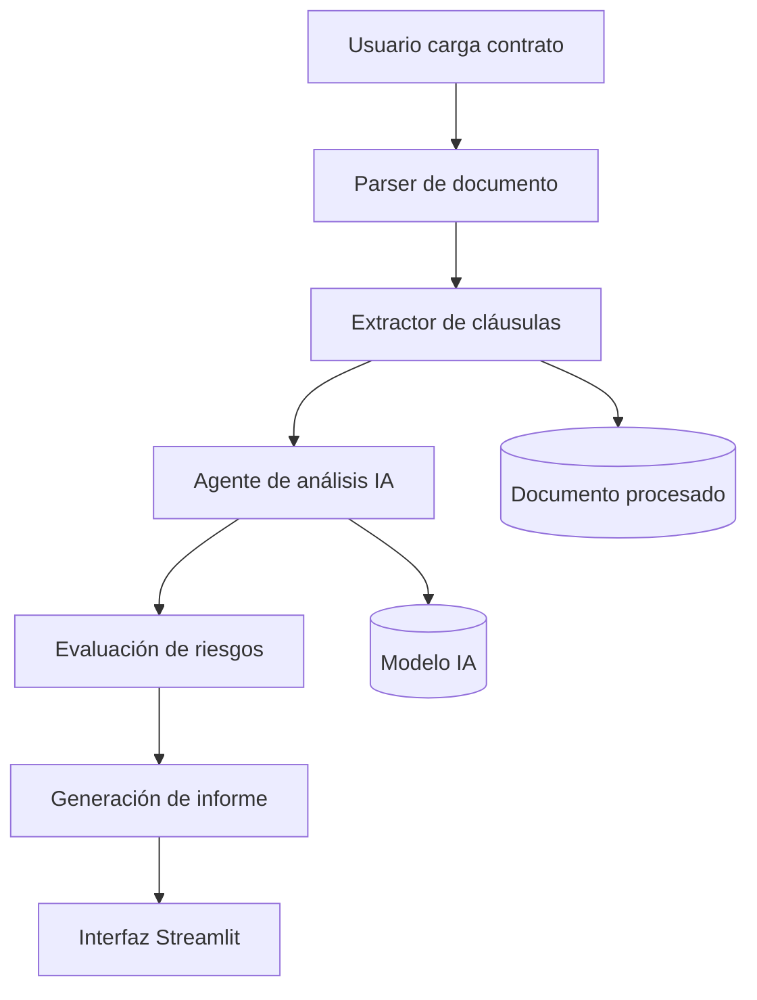

# LexIA

**LexIA** es un agente de IA para la revisión de contratos de tecnología y propiedad intelectual. Ayuda a detectar cláusulas riesgosas, analizar documentos contractuales y generar resúmenes claros para equipos legales y de negocio.

Proyecto desarrollado como prototipo de un agente de IA aplicado al análisis legal de contratos.

[](#)
[](#)
[](#)
[](#)

---

## Índice

- [Descripción](#descripción)
- [Problema que resuelve](#problema-que-resuelve)
- [Funciones principales](#funciones-principales)
- [Cómo funciona](#cómo-funciona)
- [Arquitectura propuesta](#arquitectura-propuesta)
- [Casos de uso](#casos-de-uso)
- [Capturas de pantalla](#capturas-de-pantalla)
- [Estructura del repositorio](#estructura-del-repositorio)
- [Instalación](#instalación)
- [Configuración](#configuración)
- [Uso](#uso)
- [Diseño conceptual de API](#diseño-conceptual-de-api)
- [Seguridad y aviso legal](#seguridad-y-aviso-legal)
- [Hoja de ruta](#hoja-de-ruta)
- [Contribuir](#contribuir)
- [Licencia](#licencia)
- [Autora](#autora)

---

## Descripción

LexIA está pensado para agilizar la revisión de contratos mediante extracción de cláusulas, detección de riesgos y generación de informes ejecutivos.

El objetivo no es reemplazar el criterio legal profesional, sino reducir tareas repetitivas para que las personas puedan enfocarse en negociación, análisis estratégico y toma de decisiones.

---

## Problema que resuelve

Los contratos de tecnología e IP suelen incluir cláusulas complejas que requieren análisis detallado, especialmente en:

- Acuerdos de confidencialidad (NDA).
- Contratos de servicios (MSA / SOW).
- Licencias de software.
- Cesión y protección de propiedad intelectual.
- Protección de datos.
- Limitaciones de responsabilidad e indemnidad.

LexIA ayuda a:

- Detectar cláusulas relevantes.
- Identificar posibles riesgos legales y comerciales.
- Señalar aspectos que requieren revisión humana.
- Generar un resumen ejecutivo del documento.

---

## Funciones principales

- Carga de contratos en PDF, DOCX o TXT.
- Extracción de texto del documento.
- Identificación de cláusulas contractuales relevantes.
- Análisis preliminar de riesgos.
- Generación de informes ejecutivos.
- Evaluación de cláusulas como confidencialidad, propiedad intelectual, responsabilidad, terminación y protección de datos.
- Selección del idioma del informe.
- Interfaz web desarrollada con Streamlit.

---

## Cómo funciona

LexIA sigue un flujo de revisión automatizada de contratos:

1. La persona usuaria carga un contrato.
2. El sistema extrae el contenido del documento.
3. El agente analiza las cláusulas principales.
4. Se identifican posibles riesgos o puntos de atención.
5. Se genera un informe estructurado para facilitar la revisión humana.

Ejemplo:

- Entrada: contrato SaaS con cláusulas de responsabilidad y propiedad intelectual.
- Salida: informe con resumen, cláusulas detectadas y observaciones de riesgo.

---

## Arquitectura propuesta



### Componentes

- **Parser de documentos:** permite leer archivos PDF, DOCX y TXT.
- **Extractor de contenido:** obtiene la información relevante del contrato.
- **Agente de análisis:** interpreta cláusulas y detecta riesgos.
- **Motor de generación:** produce un informe claro para revisión.
- **Interfaz Streamlit:** permite interactuar con la aplicación.

---

## Casos de uso

LexIA puede utilizarse para:

- Primera revisión de contratos tecnológicos.
- Análisis preliminar para startups.
- Revisión de acuerdos SaaS.
- Evaluación de cláusulas de propiedad intelectual.
- Apoyo a equipos legales y de compliance.
- Preparación de documentos para negociación.

---

## Capturas de pantalla

*(Agregar aquí capturas de la aplicación)*

Ejemplos:

- Pantalla principal.
- Carga y análisis del contrato.
- Informe generado.

---

## Estructura del repositorio

```txt
LEX_IA/
├── agents/
│   └── contract_agent.py
├── utils/
│   ├── pdf_reader.py
│   └── docx_reader.py
├── screenshots/
├── app.py
├── requirements.txt
├── .env.example
├── .gitignore
├── LICENSE
└── README.md
```

---

## Instalación

### Requisitos

- Python 3.11 o superior.
- Git.
- VS Code.
- Una clave API para el modelo de IA.

### Pasos

```bash
git clone https://github.com/yasminacarlafernandez/LEX_IA.git

cd LEX_IA

python -m venv .venv
```

Activar entorno virtual:

### Windows

```bash
.venv\Scripts\activate
```

### Linux / macOS

```bash
source .venv/bin/activate
```

Instalar dependencias:

```bash
pip install -r requirements.txt
```

---

## Configuración

Crear un archivo `.env` a partir del ejemplo:

```bash
cp .env.example .env
```

Configurar la clave del modelo de IA:

```env
GEMINI_API_KEY=tu_clave_api
```

---

## Uso

Ejecutar la aplicación:

```bash
streamlit run app.py
```

Flujo:

1. Seleccionar un contrato.
2. Cargar el archivo.
3. Ejecutar el análisis.
4. Revisar el informe generado.

---

## Diseño conceptual de API

Esta sección representa una posible evolución futura del proyecto.

### Endpoint propuesto

```http
POST /review
```

Recibe un contrato y devuelve un análisis estructurado.

### Estado del servicio

```http
GET /health
```

Permitiría verificar disponibilidad del sistema.

Ejemplo de respuesta:

```json
{
  "document_type": "Contrato SaaS",
  "risk_level": "medium",
  "findings": [
    {
      "category": "Propiedad Intelectual",
      "issue": "Cláusula requiere revisión",
      "recommendation": "Evaluar alcance de derechos otorgados"
    }
  ]
}
```

---

## Seguridad y aviso legal

LexIA es un asistente de revisión contractual y no reemplaza el asesoramiento legal profesional.

Recomendaciones:

- No cargar documentos confidenciales sin controles adecuados.
- Proteger las claves API.
- Mantener revisión humana final.
- Verificar los resultados generados por IA.

Para una versión productiva se recomienda incorporar:

- Autenticación.
- Control de acceso.
- Gestión segura de documentos.
- Auditoría de revisiones.
- Protección frente a documentos maliciosos.

---

## Hoja de ruta

Próximas mejoras:

- OCR para contratos escaneados.
- Comparación automática contra políticas internas.
- Exportación de informes a PDF y DOCX.
- Soporte multilenguaje.
- Mejoras en clasificación de riesgos.
- Integración con herramientas colaborativas.

---

## Contribuir

Las contribuciones son bienvenidas.

Flujo sugerido:

1. Crear un fork del repositorio.
2. Crear una nueva rama.
3. Realizar cambios.
4. Abrir un Pull Request con una explicación clara.

Áreas posibles:

- Ingeniería de prompts.
- Análisis contractual.
- Experiencia de usuario.
- Evaluación de modelos IA.
- Clasificación de cláusulas.

---

## Licencia

Este proyecto se publica bajo licencia MIT.

Consultar el archivo `LICENSE` para más detalles.

---

## Autora

**Yasmina Carla Fernández**

Abogada especializada en Propiedad Intelectual, tecnología e innovación.

Proyecto desarrollado como exploración aplicada de Inteligencia Artificial al ámbito legal.