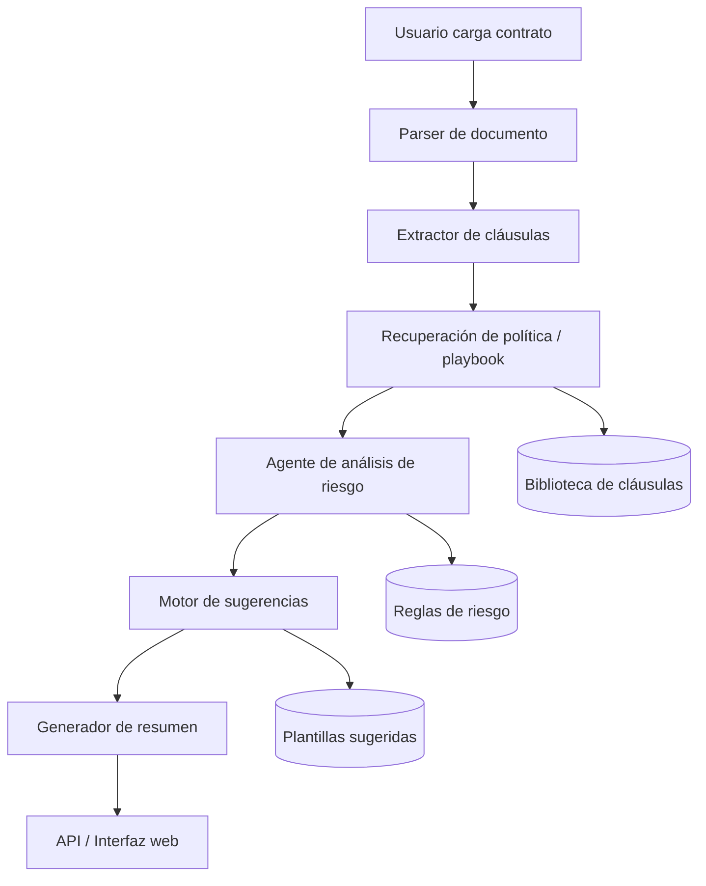

# LexIA

**LexIA** es un agente de IA para la revisión de contratos de tecnología e propiedad intelectual. Ayuda a detectar cláusulas riesgosas, comparar contratos con políticas internas, sugerir mejoras y generar resúmenes claros para equipos legales y de negocio.

[](#)
[](#)
[](#)
[](#)

---

## Índice

- [Descripción](#descripci%C3%B3n)
- [Problema que resuelve](#problema-que-resuelve)
- [Funciones principales](#funciones-principales)
- [Cómo funciona](#cómo-funciona)
- [Arquitectura](#arquitectura)
- [Casos de uso](#casos-de-uso)
- [Estructura del repositorio](#estructura-del-repositorio)
- [Instalación](#instalación)
- [Configuración](#configuración)
- [Uso](#uso)
- [Diseño de la API](#diseño-de-la-api)
- [Seguridad y aviso legal](#seguridad-y-aviso-legal)
- [Hoja de ruta](#hoja-de-ruta)
- [Contribuir](#contribuir)
- [Licencia](#licencia)
- [Autora](#autora)

---

## Descripción

LexIA está pensado para agilizar la revisión de contratos mediante extracción de cláusulas, comparación con una política interna, detección de riesgos y generación de sugerencias de redacción. Este tipo de flujo sigue el patrón de revisión automatizada de contratos: ingestión del documento, comparación contra plantillas o políticas, detección de desvíos, propuestas de cambio y resumen final [web:8].

El objetivo no es reemplazar el criterio legal, sino reducir el trabajo repetitivo para que las personas se enfoquen en negociación, excepciones y decisiones importantes.

---

## Problema que resuelve

Los contratos de tecnología e IP suelen incluir cláusulas complejas y difíciles de revisar manualmente, especialmente en NDA, MSA, SOW, licencias, asignación de propiedad intelectual, confidencialidad, indemnidad y protección de datos.

LexIA ayuda a:
- Detectar cláusulas fuera de política.
- Señalar riesgos legales y comerciales.
- Proponer redlines o texto alternativo.
- Generar un informe breve para revisión humana.

---

## Funciones principales

- Carga de contratos en PDF, DOCX o TXT.
- Extracción y clasificación de cláusulas.
- Comparación con políticas o playbooks internos.
- Detección de riesgos por lenguaje ambiguo o no estándar.
- Sugerencias de redacción alternativa.
- Resumen ejecutivo en lenguaje claro.
- Salida estructurada para flujos legales.
- Arquitectura modular para futuras integraciones.

---

## Cómo funciona

LexIA sigue un flujo en cinco pasos similar al de los agentes modernos de revisión legal: ingestión del contrato, comparación con la política, identificación de riesgos, sugerencia de cambios y generación del resumen.

1. La persona usuaria carga un contrato en PDF, DOCX o texto.
2. El agente extrae cláusulas y metadatos.
3. LexIA compara el documento con una biblioteca de políticas o un playbook.
4. El sistema detecta desviaciones o riesgos.
5. Devuelve un informe con hallazgos y sugerencias.

Ejemplo:
- Entrada: contrato SaaS con cláusula de indemnidad amplia.
- Salida: alerta de riesgo alto, sugerencia de texto alternativo y explicación breve.

---

## Arquitectura



### Componentes

- **Parser de documentos**: lee PDF, DOCX y texto plano.
- **Extractor de cláusulas**: identifica secciones como confidencialidad, IP, responsabilidad y terminación.
- **Motor de políticas**: compara el contrato con estándares aprobados.
- **Agente de riesgo**: clasifica severidad y explica el motivo.
- **Motor de sugerencias**: propone redacción alternativa.
- **Generador de resumen**: produce un informe corto y entendible.

---

## Casos de uso

LexIA sirve para:
- Revisión legal de startups.
- Evaluación de contratos de proveedores.
- Verificación de asignación de IP.
- Revisión de SaaS y licencias.
- Análisis de NDAs y MSA.
- Primera revisión antes de escalar a un abogado.

---

## Estructura del repositorio

```txt
lexia/
├─ app/
│  ├─ main.py
│  ├─ api/
│  ├─ agents/
│  ├─ parsers/
│  ├─ prompts/
│  └─ services/
├─ tests/
├─ docs/
├─ examples/
├─ .env.example
├─ .gitignore
├─ README.md
├─ LICENSE
├─ pyproject.toml
├─ CONTRIBUTING.md
├─ SECURITY.md
└─ CODE_OF_CONDUCT.md
```

---

## Instalación

### Requisitos
- Python 3.11 o superior.
- Git.
- VS Code.
- Una clave de API para el modelo de IA.

### Pasos

```bash
git clone https://github.com/tu-usuario/lexia.git
cd lexia
python -m venv .venv
source .venv/bin/activate
pip install -r requirements.txt
```

---

## Configuración

Copiá el archivo de ejemplo y completá tus valores:

```bash
cp .env.example .env
```

Ejemplo:

```env
LLM_API_KEY=tu_clave_api
MODEL_NAME=gpt-4.1-mini
TEMPERATURE=0.2
POLICY_LIBRARY_PATH=./docs/policies
```

---

## Uso

### Ejemplo por consola

```bash
python -m app.main --file examples/contrato_muestra.pdf
```

### Ejemplo de salida

- **Tipo de documento:** MSA.
- **Nivel de riesgo:** alto.
- **Hallazgos:** cláusulas no estándar.
- **Sugerencias:** redacción alternativa.
- **Resumen:** contrato con puntos que requieren revisión humana.

---

## Diseño de la API

### `POST /review`
Recibe un contrato y devuelve un análisis estructurado.

### `GET /health`
Verifica el estado del servicio.

### Esquema sugerido de respuesta

```json
{
  "document_id": "string",
  "document_type": "string",
  "summary": "string",
  "risk_score": 0,
  "findings": [
    {
      "id": "string",
      "category": "string",
      "severity": "low|medium|high|critical",
      "clause_text": "string",
      "issue": "string",
      "recommendation": "string"
    }
  ]
}
```

---

## Seguridad y aviso legal

LexIA es un asistente de revisión, no un reemplazo del asesoramiento legal.

Recomendaciones:
- No subir documentos confidenciales sin controles de acceso.
- Guardar los archivos de forma segura.
- Mantener trazabilidad de las revisiones.
- Conservar siempre la revisión humana final.

Para producción conviene agregar:
- Autenticación.
- Control de roles.
- Cifrado en tránsito y en reposo.
- Políticas de retención.
- Protección contra documentos maliciosos o prompts inyectados.

---

## Hoja de ruta

- OCR para contratos escaneados.
- Comparación cláusula por cláusula.
- Soporte multilenguaje.
- Editor de playbooks.
- Exportación a PDF y DOCX.
- Integración con Slack, Notion y GitHub Issues.
- Clasificación más fina por tipo de contrato.

---

## Contribuir

Las contribuciones son bienvenidas.

### Flujo sugerido
1. Hacé un fork del repositorio.
2. Creá una rama nueva.
3. Agregá pruebas si cambiás comportamiento.
4. Abrí un pull request con una explicación clara.

### Áreas para colaborar
- Ingeniería de prompts.
- Taxonomía de cláusulas.
- Parsers de contratos.
- Puntaje de riesgo.
- UI y experiencia de usuario.
- Evaluaciones y benchmarks.

---

## Licencia

Este proyecto se publica bajo licencia MIT. Ver el archivo `LICENSE` para más detalles.

---

## Autora

**Yasmina Carla Fernández**